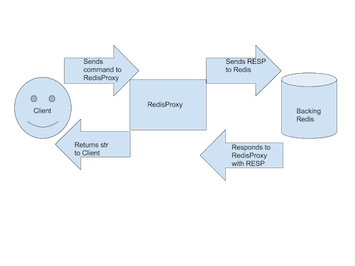

# RedisProxy

This is a transparent Redis proxy ("the proxy") serving cached GET commands. It implements a subset of the Redis protocol to do so. Of note:

  - GET commands are cached by the proxy
  - The cache is configured with LRU (Least Recently Used) eviction of keys and a max. size determined by number of keys
  - There is a single backing instance of Redis
  - There are two implementations: threaded and non-threaded because learning is fun.
  
# High-level Architecture Overview
At a high level, the proxy exists as an intermediate layer between the client and the single backing Redis server.


# What the Code Does (Threaded)
  - Parses configuration arguments passed in through the command-line, if any.
  - Starts the server, opens socket for listening for client requests. Each new client connection is its own thread.
  - Instantiates RedisProxy (Note: for the Non-threaded server, the RedisProxy's run() command uses select to listen for incoming connections.)
  - When a client connects and sends the proxy a Redis-style GET command ("GET {name}"), the proxy sends this command to the Redis server. There is some error-handling, for mal-formed input.
  * Any GET commands are cached by the proxy once the value is retrieved from Redis. If those key-value pairs have already been retrieved, they will be stored in the cache, which is an OrderedDict, under the hood.
  * The proxy's cache is configured to evict the least recently used key-value pairs when it tries to add new items and is already full. (Size is determined in number of keys.)
  * The cache also has a Time to Live (TTL) setting. Any keys that are past the TTL are evicted upon next access, and Redis is called, as if the keys were never there.
- The response is parsed and returned to the user. Error-handling also happens at this step.
- The user can QUIT the proxy connection when she is done looking at data she stored.
- CTRL-C will shutdown the proxy.

# Running the proxy: Two ways!
## On your machine
This assumes that you have cloned the git repo and have the requirements installed:
- Make sure the backing Redis-server is running and serving on its default port (6379): `redis-server`
- Run the non-threaded or threaded proxy, dependent on your preference: `python proxy.py` OR `python threaded_proxy.py` (You can also run the proxy with configs: `python redisproxy.py --addr='localhost' --ttl=7200 --capacity=1000`)
- Start up a client, such as using nc or telnet, in another window/tab: `nc localhost 5555`
- Once the client connects, you can pass Redis GET commands to the proxy:
```
nc localhost 5555
You are connected to the RedisProxy. Type QUIT to close connection
GET name
Robert Kevin
GET age
111
GET height
100
GET favfood
pizza
QUIT
Bye
```
## With docker-compose (& the threaded proxy)
In one tab:
- Build the containers for redis and the proxy `docker-compose build`
- Run in the background: `docker-compose up -d`
- Get name of proxy container w/ `docker ps` (Probably, it's `redisproxy_readcache_1`)
- Attach to the proxy container: `docker exec -it redisproxy_readcache_1 bash`
- *Note: The loading of test data in Redis, the starting of the server, and the installation of requirements is handled automatically.*
- Once inside the container, create a client connection to the proxy using netcat: `nc localhost 5555`
- Once the client connects, you can pass Redis GET commands to the proxy. The output is the same as above.

# Testing:
## Unit tests:
Because the proxy is transparent, it is difficult to test the mechanics of the the underlying data structure.

Note: You will need to install the requirements as the `mock` library is used in the unittests.
- Run `python unittests.py` for the un-threaded proxy tests
- Run `python threaded_unittests.py` for threaded proxy tests

## Manual testing/End-to-end:
Note: Because this is an interactive command-line tool, I had a hard time implementing end-to-end testing that was not brittle or hacky. I would be interested to hear your feedback on the best way to implement e2e tests for such a tool. Instead, here are manual tests. (These assume being run with test data already set in Redis. You can use the docker container.)
- Retrieve a key that is in Redis:
```
  GET name
  Robert Kevin
```
- Retrieve the key a second time. This time, it's in the cache (and it's transparent, so there's no way to know! ^^):
```
  GET name
  Robert Kevin
```
- Retrieve a key that is NOT in Redis:
```
GET prenom
Nothing exists for key prenom in Redis
```
- Send an invalid command:
```
GETT name
Please use Redis 'GET key' command format
```
 - QUIT:
 ```
 QUIT
Bye-bye!
```

Note: Multiple clients can connect at once time to the proxy. To test this, open up two `netcat` clients and send GET commands to the proxy.

### Manual testing of LRU eviction & TTL:
To test the TTL:
- Run the threaded/non-threaded proxy with a relatively low ttl: `python proxy.py --ttl=10`
- In a new tab, open a client: `nc localhost 5555`
- Ask the proxy for a key that you know is in Redis:
```
GET prénom
Mireille
```
- Work quickly: change the value for the key in backing Redis (with `redis-cli`, perhaps): `SET prénom Mireille`
- Work quickly: Ask the proxy for the same key and confirm that it has not yet expired (Will not be what you just set it to):
```
GET prénom
Mireille
```
- Wait until the TTL period has expired
- Ask the proxy for the same key and see that it has changed:
```
GET prénom
Dagobert
```


# Timing Breakdown
  - Writing the proxy: ~9 hours, incl. writing code, manual testing, research about libraries
  - Refactoring code after initial review: 2 hours
  - Implementing Threaded proxy: 5-6 hours, incl. learning SocketServer
  - Writing tests/Setting up Docker: 10 hours, incl. thrashing over end-to-end tests
  - ReadMe: 30 minutes
